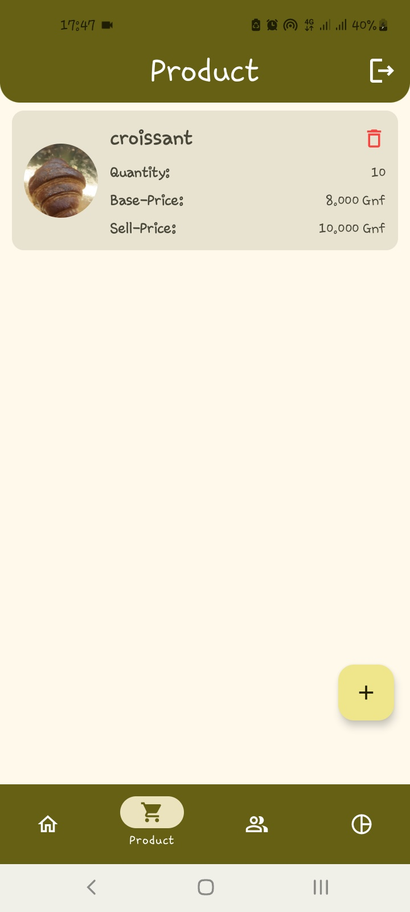

# M_Business

M_Business help you to manage your business 

## Screenshots

    
    
    

    
    
    

    
    
    

    
    
    

## Development Roadmap

- Jetpack Compose
- Room
- Clean architecture
- Hilt

